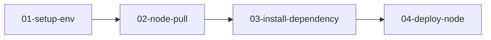
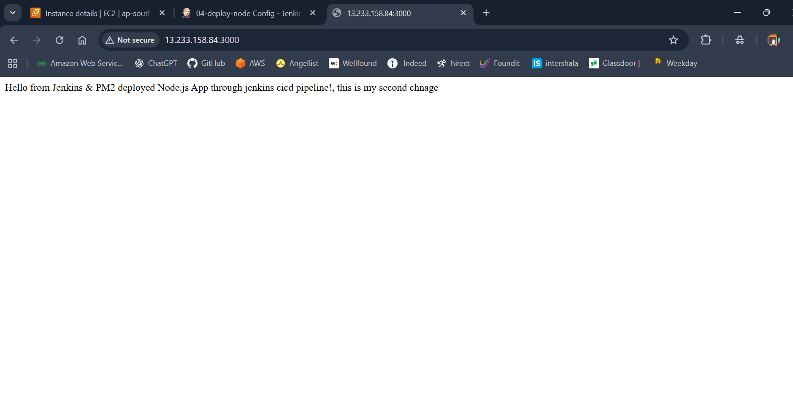

# 🚀 Jenkins CI/CD Pipeline for Node.js on AWS EC2

This project demonstrates a complete **CI/CD pipeline** for deploying a **Node.js application** using **Jenkins**, **PM2**, and **AWS EC2**.  
The pipeline automates code pulling, dependency installation, and deployment — end to end.

---

## 🧩 Project Overview

This Jenkins pipeline contains **four jobs** connected with upstream/downstream triggers:

1. **01-setup-env** – Setup Node.js & server environment  
2. **02-node-pull** – Pull latest source code from GitHub  
3. **03-install-dependency** – Install app dependencies (`npm install`)  
4. **04-deploy-node** – Deploy Node.js with PM2  

---

## 🖥️ Architecture Flow



---

## 🛠️ Tools Used

- **AWS EC2 (Ubuntu)**
- **Jenkins**
- **Git & GitHub**
- **Node.js / npm**
- **PM2 (Process Manager)**
- **Linux Shell**

---

## 📌 Job Details

### 🔵 **01-setup-env**
Sets up the EC2 environment:
- Installs Node.js, npm
- Prepares workspace directories
- Makes Jenkins user ready

---

### 🟦 **02-node-pull**
Pulls the Node.js project from GitHub.

SCM:
```
https://github.com/iamtruptimane/node-js-app-CICD.git
```

Triggered by **01-setup-env**.

---

### 🟣 **03-install-dependency**

Command used:
```bash
cd /var/lib/jenkins/workspace/02-node-pull
sudo npm install
```

Triggered by **02-node-pull**.

---

### 🟢 **04-deploy-node**

Command used:
```bash
sudo mkdir -p /var/lib/jenkins/workspace/node-pull-repo
sudo chown -R jenkins:jenkins /var/lib/jenkins/workspace/node-pull-repo
cd "/var/lib/jenkins/workspace/node-pull-repo"
pm2 start app.js --name node-app || pm2 restart node-app
```

Triggered by **03-install-dependency**.

---

# 📸 Screenshots

### 🟦 Jenkins Dashboard (All Jobs)


### 🔵 Job 02 – Git Pull Configuration


### 🟣 Job 03 – Install Dependencies


### 🟢 Job 04 – Deploy Node App Using PM2


### 🚀 Final Output – Node.js App Running on Port 3000


---

# 🎉 Result

✔ Fully automated CI/CD pipeline  
✔ GitHub → Jenkins → EC2 → PM2 deployment  
✔ Every commit triggers new build & deployment  
✔ Zero downtime deployment with PM2  

---

## 👤 Author

**Rohan Ramesh Dhenge**  
AWS & DevOps Learner  
📧 rohandhenge8680@gmail.com

---

## 🔖 Tags

#Jenkins #AWS #DevOps #NodeJS #CICD #EC2 #Pipeline #PM2 #Automation
